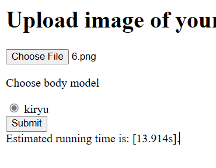
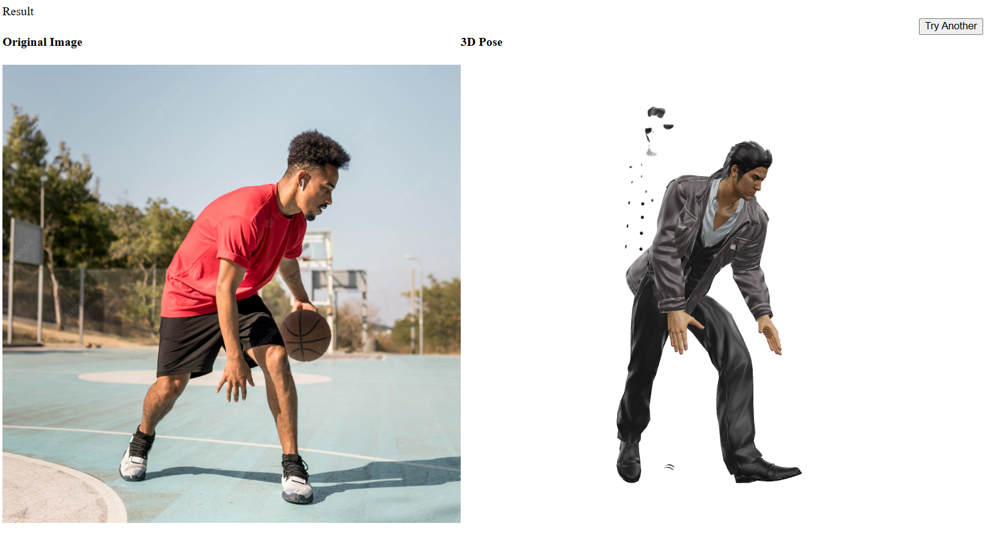
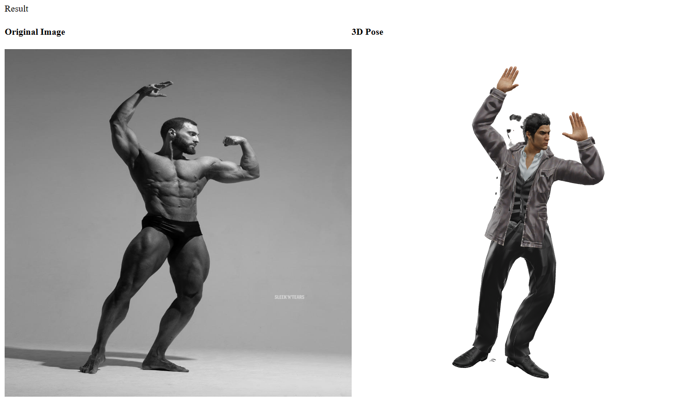
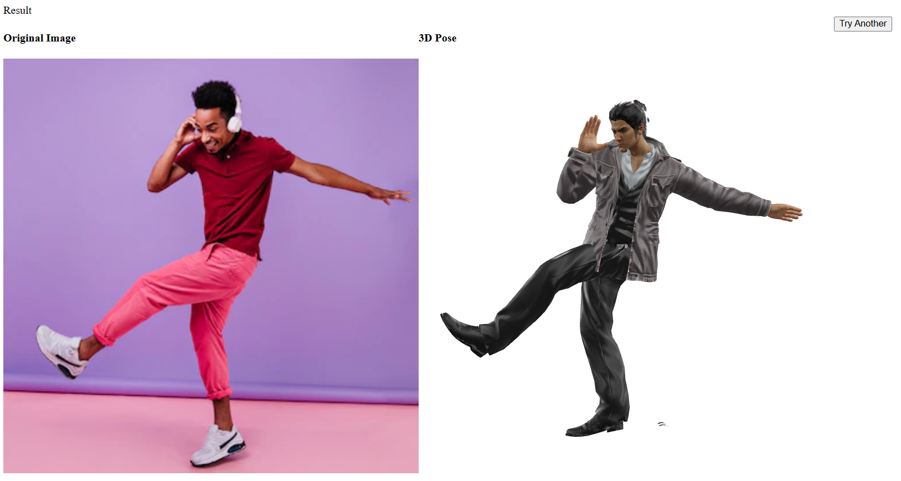
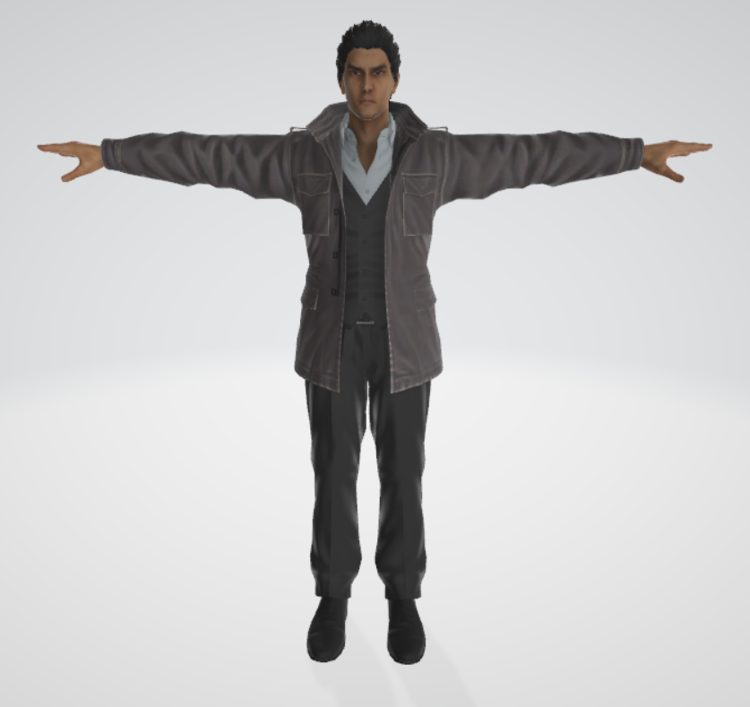

# 3D Human Pose Estimation

Adaption and Unification of AlphaPose and MotionBert. 

# Installation guide
```
# 1. Install PyTorch
pip install torch torchvision

# 2. install
pip install cython
python setup.py build develop --user
python -m pip install -r requirements.txt
python -m pip install git+https://github.com/philferriere/cocoapi.git#subdirectory=PythonAPI
pip uninstall cython_bbox
pip install git+https://github.com/valentin-fngr/cython_bbox.git # to fix np.float deprecated issue
```

Install Blender 2.93, and add `blender` to environment path.
For example, if your blender executable is under `C:/Users/ABC/Blender 2.93/path/to/blender.exe`,
add `C:/Users/ABC/Blender 2.93/path/to/` to your environment path. 

Download Yolo detection model from google drive
https://drive.google.com/open?id=1D47msNOOiJKvPOXlnpyzdKA3k6E97NTC
put it in `detector/yolo/data/`

Download 2D pose detection model from google drive
https://drive.google.com/file/d/1S-ROA28de-1zvLv-hVfPFJ5tFBYOSITb/view
put it in `pretrained_models/`

Download 3D pose lifting model from google drive
https://drive.google.com/file/d/1Om_hULE-6JLtOtZuBwjlD1xzzH6at0sV/view
put it in `checkpoint/pose3d/FT_MB_lite_MB_ft_h36m_global_lite/`

# Testing guide
Under activated virtual environment, run 
```
python webserver.py
```
Follow the instruction from the HTML page. 

Some of the results below:









# Use your own model!
Please see `./blender_files/instructions.txt` for how to add your own models.
Once you add it correctly, rerun `python webserver.py` again,
the program should be able to detect your model right away. 

I'm not an expert on Blender nor webpage design, so the website is a bit crappy, 
but what I'm trying to share is the easy usage of 2D image to 3D Pose and realize it
using Blender-Python scripting. 
If you want to help me improve the webpage design, feel free to contact me! 
I appreciate any kind of support from the community. 

# Misc

The output from MotionBert is of shape [1, N, 17, 3], N stands for number of images.
This means there is 17 3-dimensional points. 

17 Keypoints format used in MotionBert:

https://github.com/JimmySuen/integral-human-pose/blob/master/pytorch_projects/common_pytorch/dataset/hm36.py#L32

which are 

'root', 'RHip', 'RKnee', 'RAnkle', 'LHip', 
'LKnee', 'LAnkle', 'torso', 'neck', 'nose', 
'head', 'LShoulder', 'LElbow', 'LWrist', 'RShoulder', 
'RElbow', 'RWrist'

# Credit for 3D Model use

(This is the MC from my favorite video game!)

Since I didn't make this 3D model myself, there are some issue when rigging the character,
you can see there are some strands of hair and the buttons from his clothes floating in the air, 
I didn't spend time fixing this because I think this is a minor visual issue. 




3D Model [Kiryu Kazuma] Credit to 

"Yakuza 5 - Kazuma Kiryu (utility jacket)" (https://skfb.ly/oHNUL) by We_Will_Meet_Again is licensed under Creative Commons Attribution (http://creativecommons.org/licenses/by/4.0/).